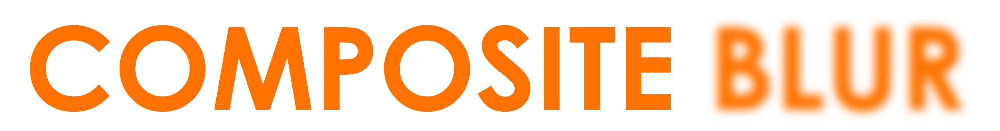
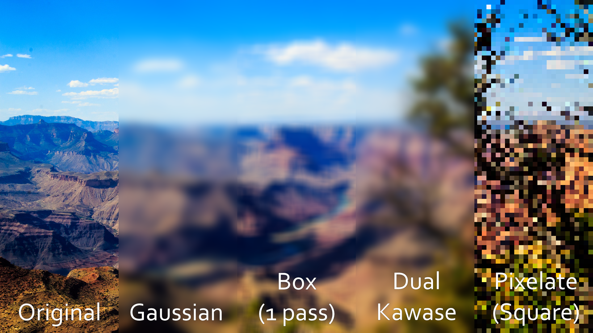
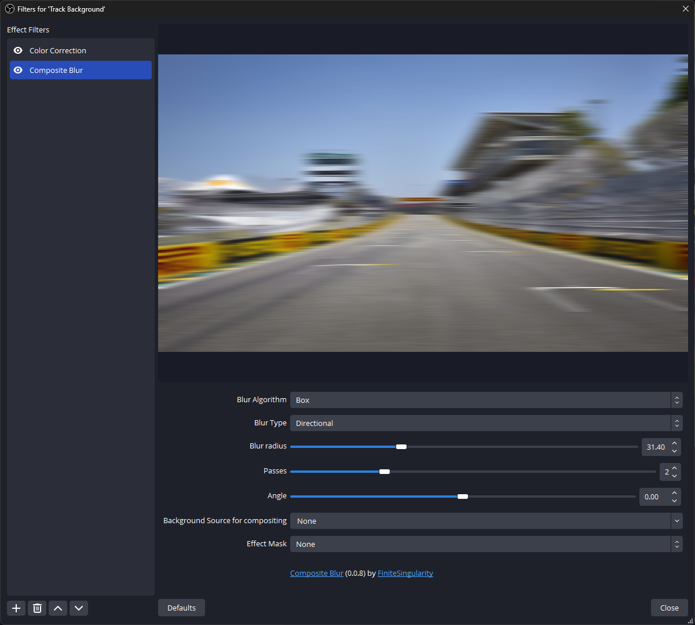
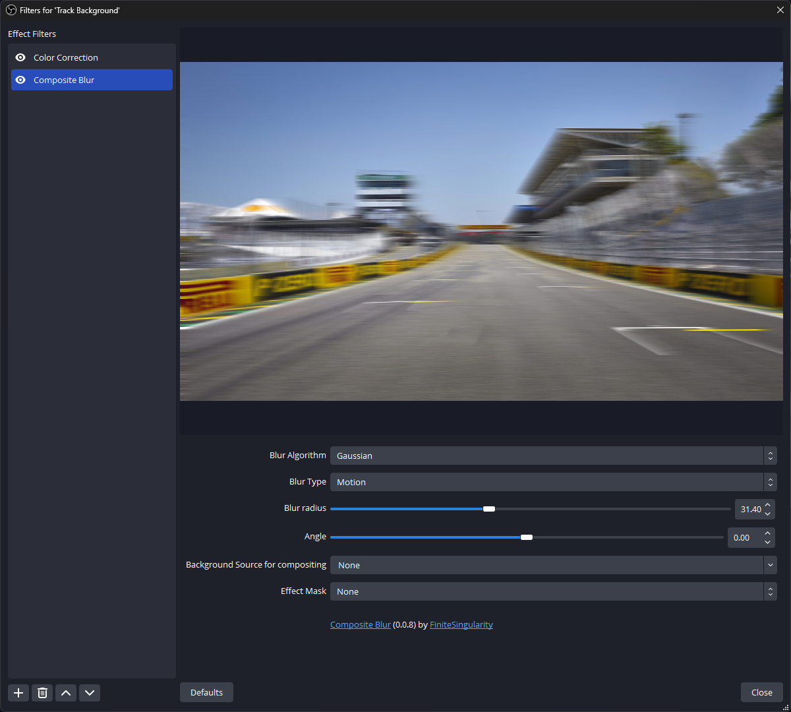
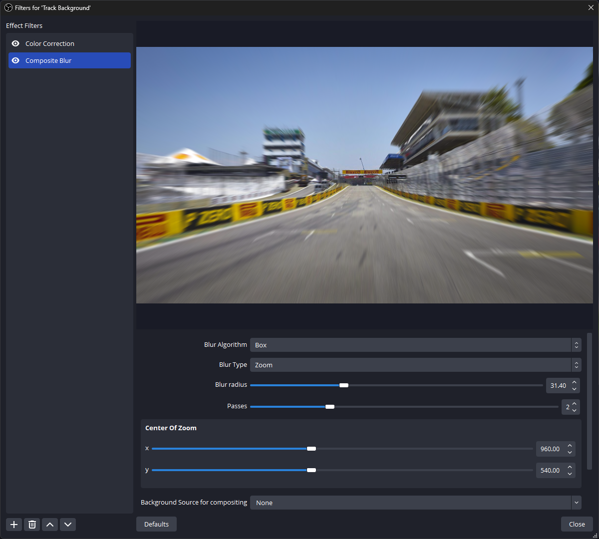
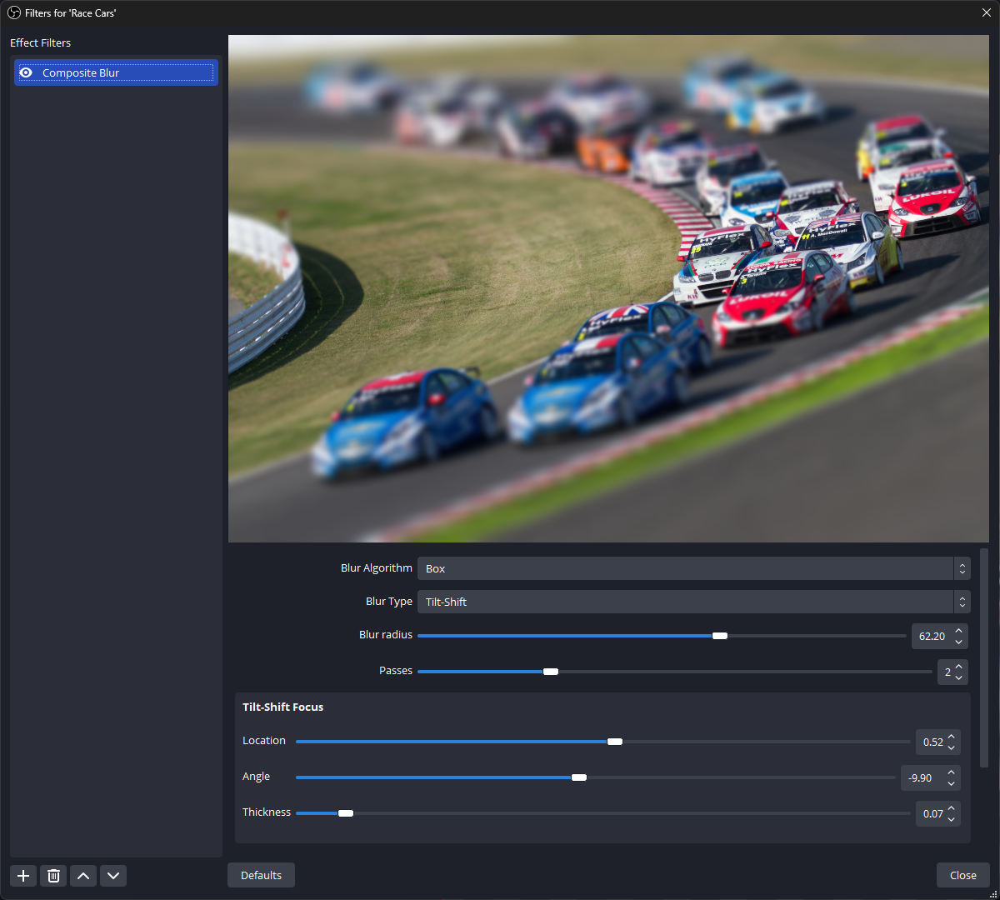
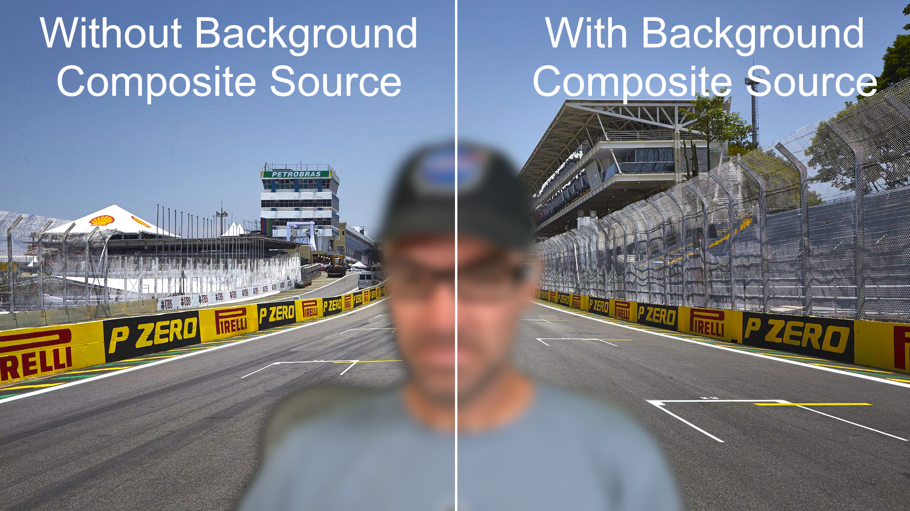
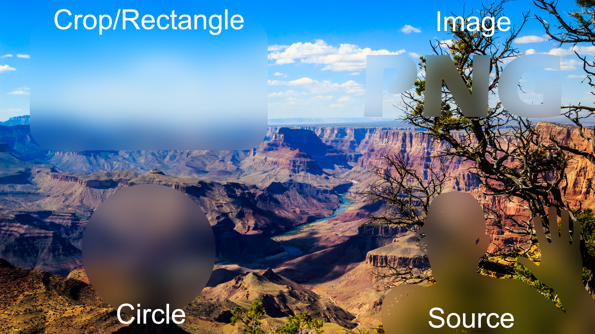

<h1 align="center">
    
</h1>

    <i align="center">A feature rich and efficient blur plugin for OBS</i>

<h4 align="center">
    
    
    
    
     
    
    
</h4>

> **Note**
> While we only release new versions of Composite Blur after testing it on local hardware, there are bugs and issues that will slip through. If you happen to run into any issues, please [open an issue](https://github.com/finitesingularity/obs-composite-blur/issues) and we will work to resolve it.

## Introduction

Composite Blur Plugin is a comprehensive blur plugin that provides blur algorithms and types for all levels of quality and computational need.

- 🚀 Composite Blur provides several highly optimized [blur algorithms](#blur-algorithms) including [Gaussian](#gaussian), [Multi-Pass Box](#box), [Dual Kawase](#dual-kawase-dual-filter), and [Pixelate](#pixelate). Composite Blur also support Windows, MacOS, and Linux for _all_ blur types.
- 📦 Composite Blur provides multiple [blur effects](#blur-effects) to give a different look and feel to the blur including [Area](#area), [Directional](#directional), [Zoom](#zoom), [Motion](#motion), and [Tilt-Shift](#tilt-shift).
- ➕ Composite Blur also allows setting a `Background Source` so that it can properly [composite blurred masks](#composite-background), allowing you to properly layer blurred sources.
- 🎭 Finally, Composite Blur provides an option to mask where and how much blurring occurs on the source via [Crop](#crop), [Rectangle](#rectangle), [Circle](#circle), [Source](#source), and [Image](#image) masks.

## Installation

Go to the [Releases Page](https://github.com/FiniteSingularity/obs-composite-blur/releases), click `Assets` under the latest release, and select either the Windows, MacOS, or Linux installer. Download the file, and run it, to install for your copy of OBS.

## Blur Algorithms

Composite Blur provides several different algorithms to blur your sources. The blur algorithms are written with performance in mind using techniques like linear sampling and GPU texture interpolation to stretch what your GPU can do. Additonally, the algorithms have been written with finely adjustable blur amounts, that allow for smooth transitions and animations when using other plugins like Move Transition.

*Example showing area blur for different algorithms. Click image for full resolution*

### Gaussian

A high quality blur algorithm that uses a gaussian kernel to sample/blur. Gaussian sampling results in an aestetically pleasing blur, but becomes computationally intensive at higher blur radius. This plugin supports fractional pixels for Gaussian blur, which allows for smooth animation when using plugins like Move Transition. The Gaussian Blur Algorithm supports [Area](#area), [Directional](#directional), [Zoom](#zoom), and [Motion](#motion) blur effects.

### Box

Box blur works similar to Gaussian, but uses an equally weighted sample of surrounding pixels. The upside is a more efficient blurring algorithm, at the expense of some quality. With one pass, box blur can cause some blocky artifacts in some cases. This can be mitigated by increasing the number of passes- a 2 pass box blur has nearly the same quality as Gaussian blur. This plugin allows the user to specify up to 5 passes. Similar to Gaussian, this implementation of box blur allows for fractional pixels for smooth animation. The Box Blur Algorithm supports [Area](#area), [Directional](#directional), [Zoom](#zoom), and [Tilt-Shift](#tilt-shift) blur effects.

### Dual Kawase (Dual Filter)

Dual Kawase is a blurring algorithm that uses down and upsampling in order to blur the image. It has a high quality blur with little artifacting and is computationally efficient especially at larger blur values. The naieve implementation of Dual Kawase however has very large jumps in blur- essentially doubling the blur at each step. This implementation sacrafices a small amount of efficiency, but allows intermediate blur values by using linear interpolation during the final downsamping step. This gives a continuous change in blur values. The most common use for Dual Kawase is when you need a very high blur radius, but with the linear interpolation step this implementation has, it can also be used as a general blur. Due to how the algorithm works, only [Area](#area) blur is available.

### Pixelate

Pixelate divides the souce into larger pixels, effectively downsampling the image, and giving it a bitmap like appearance. This plugin allows the user to specify the pixel size and shape. Supported shapes are Square, Hexagon, Triangle, and Circle. As with the other algorithms, fractional pixel sizes (blur radius) are supported. The Pixelate Algorithm only supports the [Area](#area) blur effect.

## Blur Effects
Composite Blur provides several different blur effects or types, all giving a different feel to the resulting image.

### Area
Area blur is the typical 2D blur where pixels are blurred equally in all directions. The only adjustable input for area blur is the blur radius (or pixel size for pixelate)

### Directional
Directional blur is a blur applied along a single axis, but is blurred in both the positive and negative direction. Adjustable inputs for directional blur are the blur radius and direction angle.

### Motion
Motion blur is similar to [Directional Blur](#directional), however it is applied in only the positive direction along the blur axis. This yields an image that simulates a camera capturing blur due to motion in a particular direction. Adjustable inputs are blur radius and direction angle.

### Zoom
Zoom blur is applied away from a center zoom point, and increases the further from the center point the pixel being blurred is. This yields an image that looks like the viewer is zooming into the center zoom point. Adjustable inputs are blur radius, and center zoom point location.

### Tilt-Shift
Tilt-Shift blur defines an in-focus plane, specified by a location in the frame, and a thickness. All pixels outside of the in-focus plane have their blur value increased the further away from the plane they are. The resulting image gives a distorted sense of scale, making large objects look like mineature models. When applied to video scenes like a city street, the effect can be significant. Adjustable inputs are blur radius, focus plane angle, focus plane location, and focus plane thickness.

## Composite Background
Blurring sources that have different dimensions than the canvas can be difficult to do in OBS, as filters do not have access to what is being blurred behind the filtered source. Composite Blur gives users the option to add a second OBS source as the `Background Source for Compositing` input, allowing the blur algorithms to mix in the proper color. This prevents the dark halos that are seen around such masked sources after blurring. This does, however, require that both the masked/blurred source, and the background source, have the same aspect ratio, and 1:1 overlay/coverage.

*An example with and without background source compositing. Notice the dark halo around the non-composited facecam, versus the smooth and more natural blurring into the background when a background source is provided.*

> **Warning**
> There is currently a bug that requires composite background enabled sources to set their blending method to SRGB Off if the source is cropped in OBS.  To do this, right click the source, and select 'SRGB Off' under `Blending Method`

## Effect Masking
Composite Blur offers a variety of ways to mask where and how blur is applied to your source. For all mask options, the mask can also be inverted by checking the "Invert Mask" box. The following options are available.

*Examples of the different types of masks.*

### Crop
Specify the percentage distance in from the top, bottom, left, and right edges of your source that you want masked. Additionally, the crop mask allows you to specify a corner radius for those smooth rounded corners.

### Rectangle
Is the same as the [Crop](#crop) option, but instead of specifying the edges, you specify the center of the rectangle, the rectangle width, and rectangle height. This is easier to use with plugins like Move Transition if you want to animate the movement or size of the rectangular masked blur.

### Circle
Similar to the [Rectangle](#rectangle) option, but lets you specify the center of a circle and its radius. Some nice sweep effects can be made by using a very large circle, and moving it from off the source (less than 0 or greater than 100 for the center coordinates) over the source.

### Source
Use another OBS source or scene as a mask for your blur. Simply select the source or scene you want to use, and then specify if you want to use the source's alpha channel, grayscale value, luminosity, or a custom combination of the red, green, blue, and alpha channels to mask the blur effect. You can also multiply the resulting mask by a value. The multiply value comes in handy if you have a translucent source, but want everything behind the translucent source to be fully blurred.

### Image
All of the same options as [Source](#source), but allows you to select an image file rather than a source.

## Contributors

<!-- ALL-CONTRIBUTORS-LIST:START - Do not remove or modify this section -->
<!-- prettier-ignore-start -->
<!-- markdownlint-disable -->
<table>
  <tbody>
    <tr>
      <td align="center" valign="top" width="14.28%"><a href="https://github.com/FiniteSingularity"> <b>FiniteSingularity</b></a> <a href="#code-FiniteSingularity" title="Code">💻</a> <a href="#doc-FiniteSingularity" title="Documentation">📖</a></td>
      <td align="center" valign="top" width="14.28%"><a href="https://github.com/exeldro"> <b>Exeldro</b></a> <a href="#code-exeldro" title="Code">💻</a></td>
      <td align="center" valign="top" width="14.28%"><a href="https://github.com/prgmitchell"> <b>prgmitchell</b></a> <a href="#bug-prgmitchell" title="Bug reports">🐛</a></td>
      <td align="center" valign="top" width="14.28%"><a href="https://www.youtube.com/andilippi"> <b>Andi Stone</b></a> <a href="#bug-andilippi" title="Bug reports">🐛</a></td>
    </tr>
  </tbody>
</table>

<!-- markdownlint-restore -->
<!-- prettier-ignore-end -->

<!-- ALL-CONTRIBUTORS-LIST:END -->
This project follows the [all-contributors](https://allcontributors.org) specification.
Contributions of any kind are welcome!
